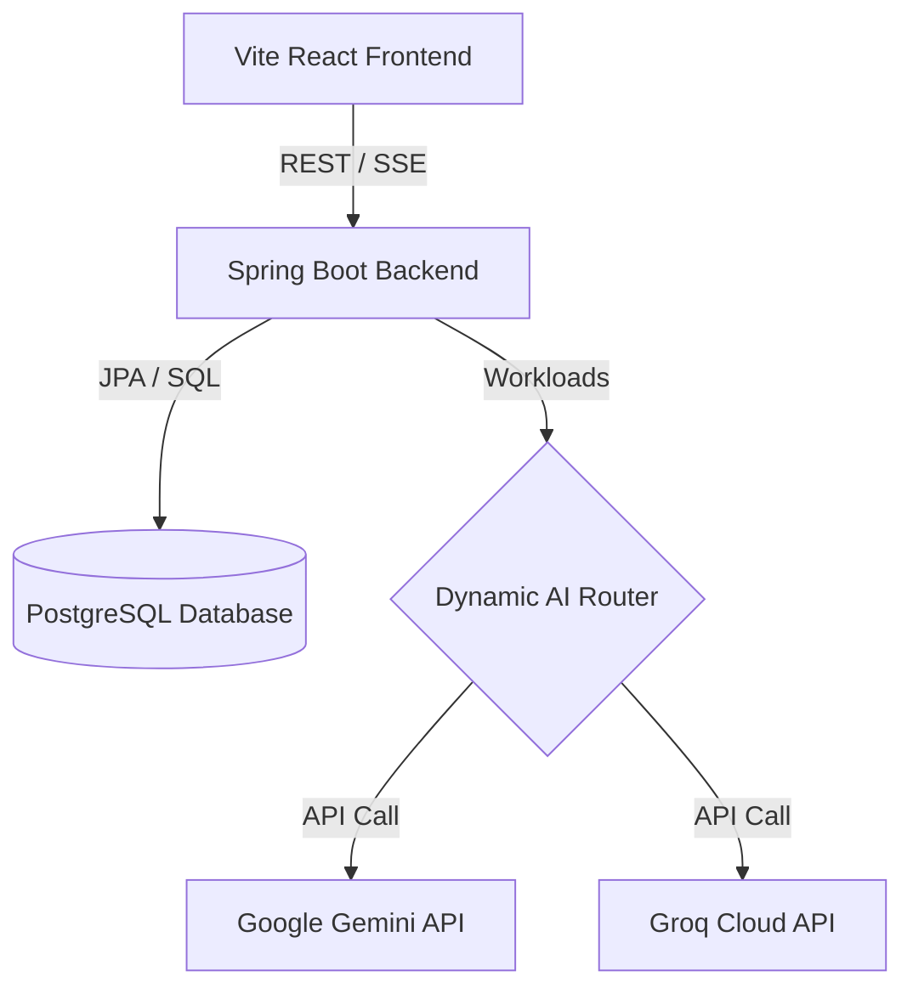

# AI Course Generation Platform

This repository contains the full-stack **AI Course Generation Platform**, a state-of-the-art learning management and course generation system. The platform allows users to leverage advanced Large Language Models (LLMs) to automatically structure curriculums, generate rich interactive lessons, collaborate with peers, and study with an AI coach.

The application is built on a modern enterprise architecture featuring a **Spring Boot backend** (running on **Java 25**), a **Vite React frontend**, and a **PostgreSQL database**.

---

## Key Platform Features

### 🌟 AI Course Generation & Outlines
* **Automatic Curriculum Generation**: Specify a topic, difficulty (Beginner, Intermediate, Advanced), and duration (e.g., "5 Hours") to generate a complete course with multiple modules and lessons.
* **Outline Drafts**: Generate the course structure and modules first, allowing customization and editing before creating full lesson contents.
* **Custom Course Builder**: Manually build, reorder, rename, or delete modules and lessons to create customized course paths.

### 📚 Interactive Lessons & Rich Content
* **Dynamic Lesson Enrichment**: Auto-generates detailed content blocks (theory explanations, code examples, exercises, and inline quizzes) for lessons using AI.
* **Real-time AI Coach**: A contextual learning assistant that answers student questions, referencing the current course and module state. Supports standard REST and SSE (Server-Sent Events) streaming.

### 👥 Collaboration & Sharing
* **Public & Private Share Links**: Generate secure sharing links for courses with settings for max enrollments and access allowlists.
* **Direct Invitations**: Invite colleagues or students to join a course via direct invites.
* **Course Leaderboards**: Engage users with shared course leaderboards tracking student progress.

### 📈 Gamification & Progress Tracking
* **Progress Tracking**: Tracks completions of lessons, modules, and courses with persistent statistics.
* **User Streaks**: Rewards consistent study habits with streaks and weekly/global point leaderboards.

### 🛠️ LLM Operations & MCP Integration
* **Multi-LLM Dynamic Routing**: Configurable routing of AI workloads to different LLM providers (e.g., Gemini, Groq) with automatic failover and load metrics.
* **Background Auto-Generation Queue**: Background scheduler that automatically generates pending lesson drafts in batches.
* **Model Context Protocol (MCP)**: Supports connecting to external systems using MCP to run audited tools.

---

## Architecture & Technology Stack



### Backend (Java 25 & Spring Boot)
* **Spring Boot 3.x** and **Java 25** utilizing virtual threads for high performance.
* **Spring Security** with JWT token validation and role-based access control.
* **Hibernate / Spring Data JPA** for data persistence.
* **Real-time Streaming**: Server-Sent Events (SSE) for real-time notifications and AI responses.

### Frontend (React & Vite)
* **React 18** with **Vite** for rapid hot-reloads and optimized production builds.
* Modern layout styled with **TailwindCSS** and **Lucide Icons** for premium UI/UX aesthetics.
* Context-driven state management for authentication, features, and theme preferences.

---

## Running the Application with Docker

### Prerequisites
Make sure you have [Docker](https://www.docker.com/) and [Docker Compose](https://docs.docker.com/compose/) installed on your machine.

### Quick Start
1. Navigate to the root directory of the project.
2. Build and start all services (Database, Backend, and Frontend) in the background:
   ```bash
   docker-compose up --build -d
   ```
3. To view logs and monitor progress:
   ```bash
   docker-compose logs -f
   ```
4. To stop the application:
   ```bash
   docker-compose down
   ```

### Accessing the Services

* **Frontend UI**: Open [http://localhost:3000](http://localhost:3000) in your web browser.
* **Backend API**: The API runs on [http://localhost:8080](http://localhost:8080).
* **Database**: PostgreSQL is exposed locally on port `5432` (Username: `postgres`, Password: `password`, Database: `aicourse`).

---

## API Documentation

The complete v1 REST API documentation has been moved to the **GitHub Wiki**. 

For local reference, you can view the structured Markdown file containing all request models, response schemas, and error definitions at:
👉 [API-Documentation-v1.md](file:///c:/Project/aicourse-generator-spring-boot/docs/API-Documentation-v1.md)

---
*Generated by Antigravity AI - System Documentation Module*

